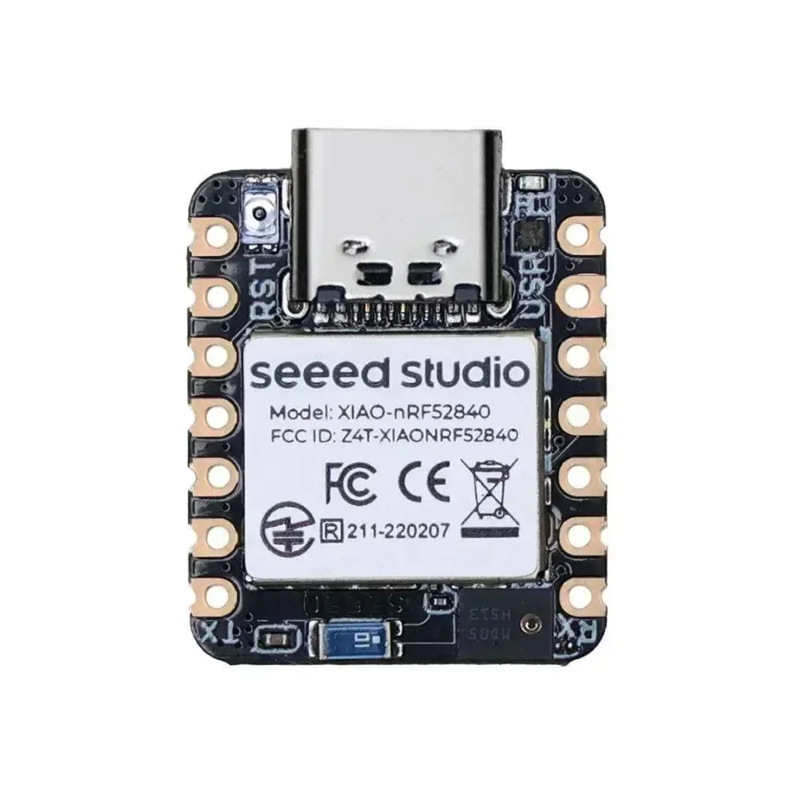
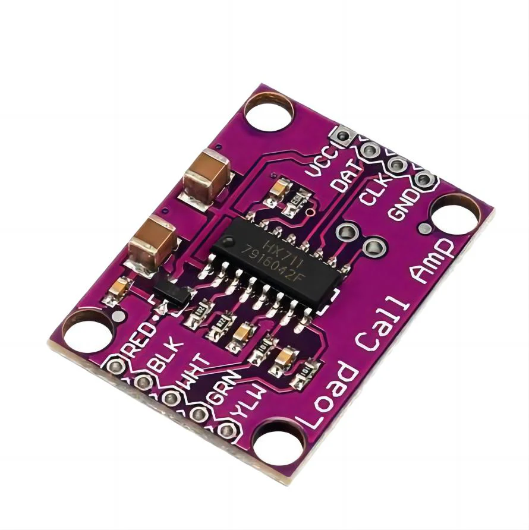
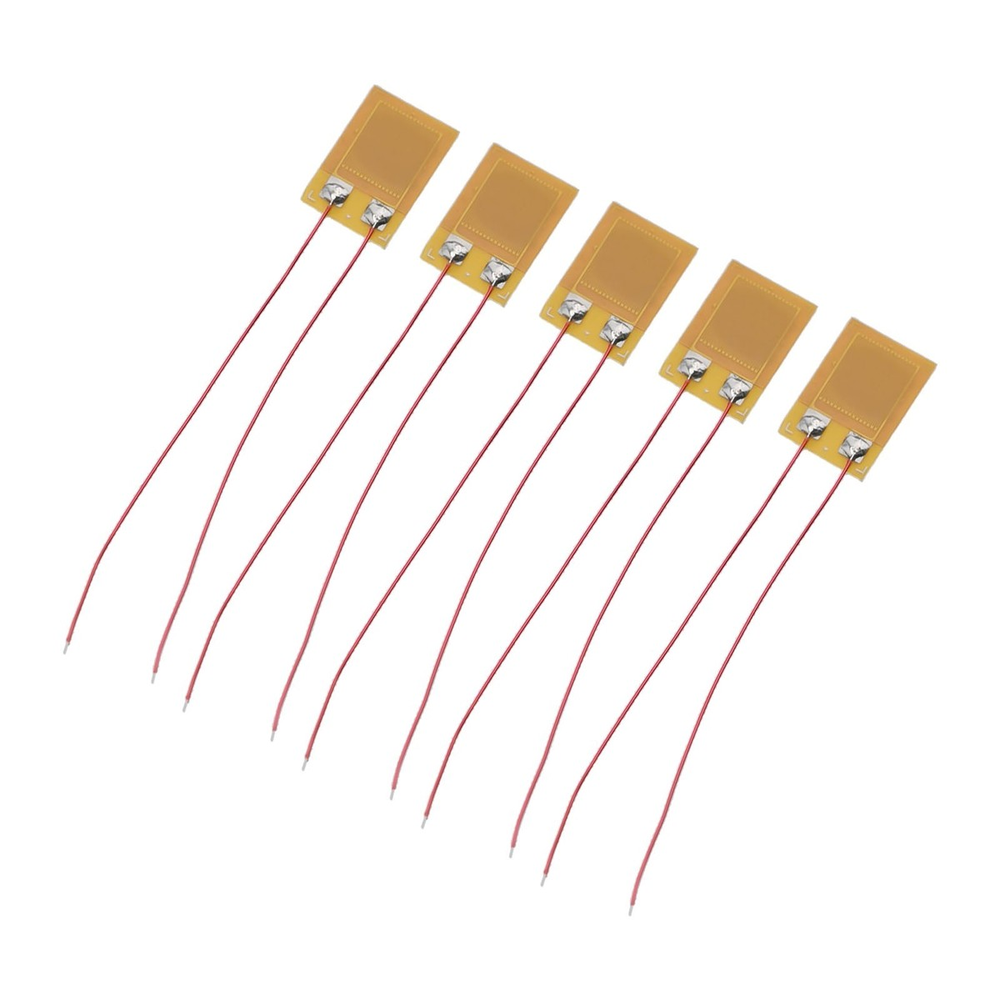
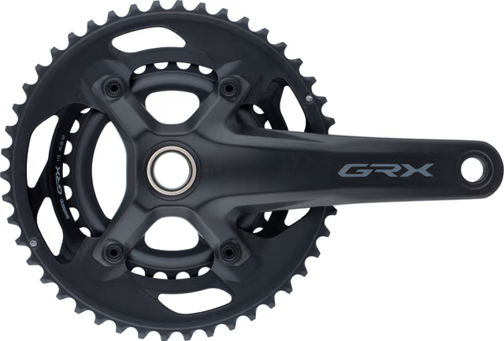
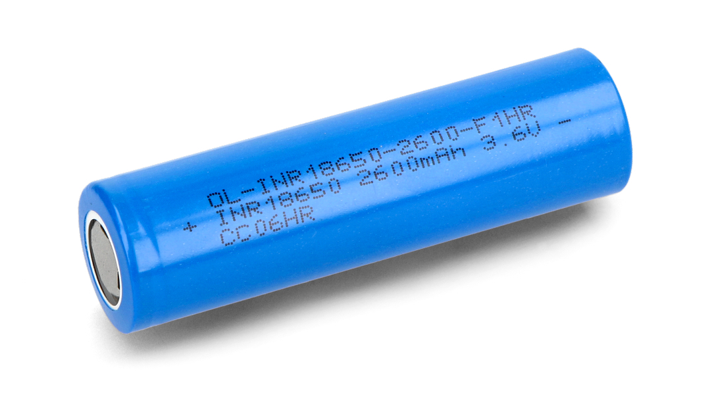
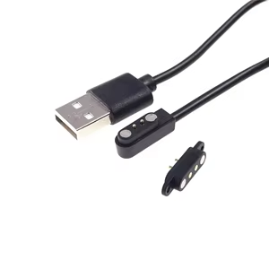

# DIY Cycling Power Meter

A single-sided crank-based cycling power meter built around the **Seeed XIAO nRF52840 Sense**, a set of **strain gauges**, and the classic **HX711 load cell amplifier**. Cadence is measured using the onboard 6-axis IMU (gyro), and everything is transmitted over Bluetooth using the official **Cycling Power Profile (CPP)** so that bike computers and apps (Garmin, Wahoo, Zwift, etc.) recognize it as a real power meter.

---

## Hardware Overview

| Component | Image |
|-----------|-------|
| Seeed XIAO nRF52840 Sense |  |
| HX711 Load Cell Amplifier |  |
| Foil Strain Gauges |  |
| Shimano GRX Right Crank (example) |  |
| 18650 Li-ion Battery |  |
| Weatherproof Magnetic Charger |  |

---

## Features

* **Power measurement** via 4-gauge Wheatstone bridge + HX711.
* **Cadence detection** using the onboard LSM6DS3 gyro (no magnets).
* **Bluetooth Low Energy (BLE)** Cycling Power Profile (standardized).
* **Auto sleep / wake-on-motion**: goes into µA standby when idle, wakes when you touch the pedals.
* Runs from a single **18650 Li-ion cell** for months.
* **Zero-offset and calibration routines** built in.

---

## Why these components?

* **Seeed XIAO nRF52840 Sense**

  * Tiny, low-power, has BLE built in.
  * Includes a 6-axis IMU perfect for cadence detection.
  * Has built-in lithium cell charger (really slow but hey, its tiny)

* **HX711 load cell amplifier**

  * Cheap, easy to use, widely supported.
  * Commercial meters often use more advanced ADCs (TI ADS-series, custom ASICs), but HX711 works fine for DIY.

* **Strain gauges**

  * Standard foil gauges arranged in a full Wheatstone bridge give best sensitivity and thermal stability.

* **18650 battery**

  * High energy density, rechargeable, common in DIY.

* **Weatherproof magnetic connector**

  * Used for charging instead of USB-C.
  * Safer for outdoor use (rain, mud).
  * Prevents wear and tear on the tiny XIAO USB connector.

---

## Hardware setup

* Mount 4 strain gauges on the **right crank arm** (single-sided measurement).
* Wire them as a **full Wheatstone bridge** → connect to HX711 breakout.
* HX711 `DOUT` → XIAO pin D2.
* HX711 `SCK`  → XIAO pin D3.
* IMU is onboard (LSM6DS3). Its INT1 can be connected to pin D7 if you want hardware wake.
* Power everything from the 3.3V regulated by the XIAO.

---

## Software overview

* **Cadence detection**:

  * Gyroscope outputs angular velocity in deg/s.
  * Smoothed with a simple low-pass filter.
  * Positive → negative → positive zero-crossing = one crank revolution.

* **Power calculation**:

  * HX711 reads torque via strain gauges.
  * Torque = Force × crank length.
  * Power = Torque × angular velocity.
  * Calibration is required to convert HX711 counts into Newtons.

* **BLE output**:

  * Implements Cycling Power Measurement characteristic (`0x2A63`).
  * Sends instantaneous power + cumulative crank revolutions + event time.

* **Low power**:

  * Two levels of power saving:
    * **Sleep mode (active riding):** MCU idles between HX711 interrupts (~80 Hz). Current consumption stays very low while still capturing every torque sample.
    * **Deep sleep (no movement):** After configurable inactivity timeout, HX711 powers down, MCU enters System OFF, IMU stays in ultra-low-power motion detection (~10 µA). A pedal movement wakes the system and it restarts cleanly.

---

## Calibration

Two steps are required:

1. **Zero offset (tare):**  
   * With the crank unloaded, record the HX711 raw offset.  
   * This removes drift and ensures 0 Nm torque at rest.  

2. **Scale factor (known weight):**  
   * Hang a known mass on the pedal at a known crank length.  
   * Example: 10 kg at 175 mm → Torque = 10 × 9.81 × 0.175 ≈ 17.15 Nm.  
   * Record HX711 counts and compute the conversion factor (counts → Newtons).  

The firmware includes helper functions to perform both steps.

---

## Limitations / notes

* Single-sided (right crank only) → doubles value to estimate total power. This is good for approximately 95% of the people, dual side crank power meters offer more data (left right crank balance and ±4% more precision) that really only is necessary if you're training for the world top.
* HX711 is not as precise as commercial solutions, but cheap and works well enough. Same story as above.
* Firmware currently uses a simple exponential moving average filter; better DSP could improve cadence stability.

---

## Roadmap / ideas

If the project gets a lot of attention (or if I get bored in the winter), I might try to implement these features

* Add left-right balance (second crank).
* Switch HX711 to ADS1232/ADS131M for higher resolution.
* Add ANT+ broadcasting.
* Smarter filtering for cadence detection.

---
