# DIY Cycling Power Meter

**What I've made**

A fully working BLE cycling power meter mounted on the left crank of my gravel bike. It broadcasts via Bluetooth using the standard **Cycling Power Profile** so it just shows up as a power meter in Garmin, Wahoo, Zwift, TrainerRoad, or whatever you ride with.

---

## The Story

I am a big nerd and as soon as I got into cycling, I of course wanted more data. The best data for cycling is of course power, so I quickly stumbled down the path of wanting to buy a power meter. Commercial power meters start around €300 and go up fast. I stared at the price tags for a while, then thought: *how hard can it be, it's just a strain gauge readout and some Bluetooth*.

Spoiler: harder than expected. Been working on it (off and on) for a bit less than a year now.

The first version used the **right crank**, which turned out to be a pain. Issues with clearance and wiring routing to the battery which I wanted to fit inside the hollow crank. After some frustration I switched to the **left crank**, which has a larger clearance between rear fork and pedals and makes everything much neater.

### Things I Struggled With

- Getting the HX711 data to be readable
- The Bluetooth Cycling Power Profile spec is... not exactly beginner-friendly documentation
- Getting Garmin to accept and display the zero-offset calibration correctly (there's a whole control-point dance involved)
- **Battery life**, early iterations with 350Ω gauges drew too much current. Switching to **1kΩ Wheatstone bridge sensors** cut standby current dramatically
- Cadence via gyro integration works great but needed careful deadband tuning to avoid phantom revolutions at low speeds
- Making it weatherproof enough for wet rides while still being easy to charge
- Worst of all, testing cadence on my record player. Fine-tuning for weeks because I thought I was off, only to find out my record player was off and the cadence measurement was actually on point. 

The final unit draws **~10mA while riding** and **~0.07mA in standby**. The 300mAh battery lasts a very long time.

---

## The Final Result

| | |
|---|---|
| Mounted on the Shimano left crank | 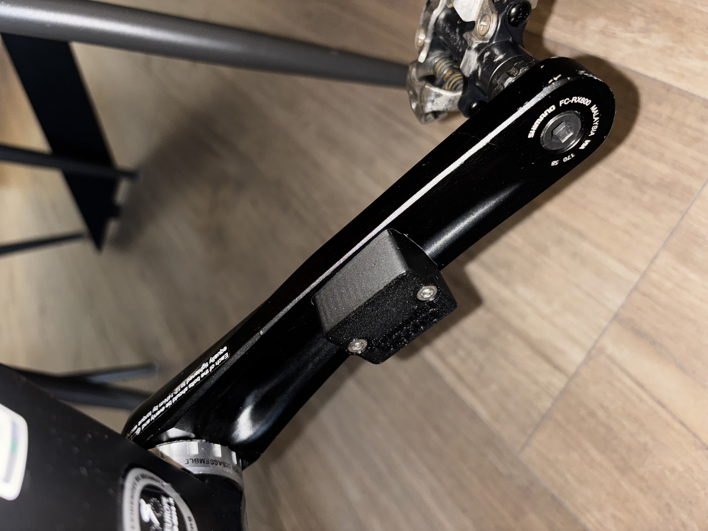 |
| Electronics on the crank | 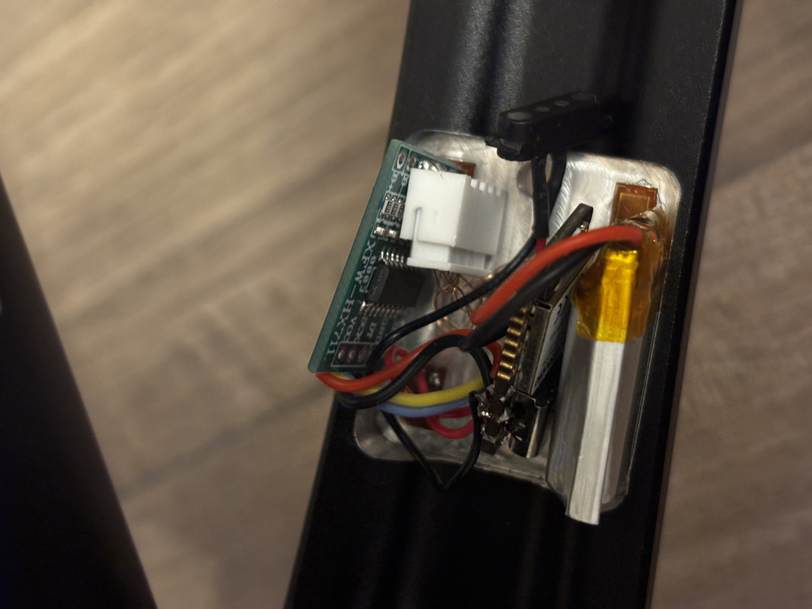 |
| 4× strain gauges in Wheatstone bridge | 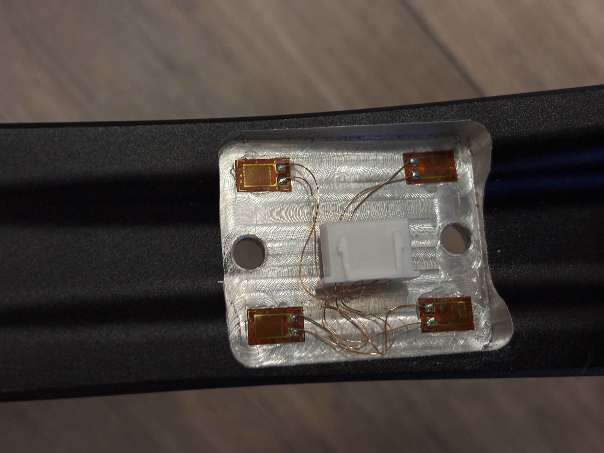 |
| 3D printed enclosure | 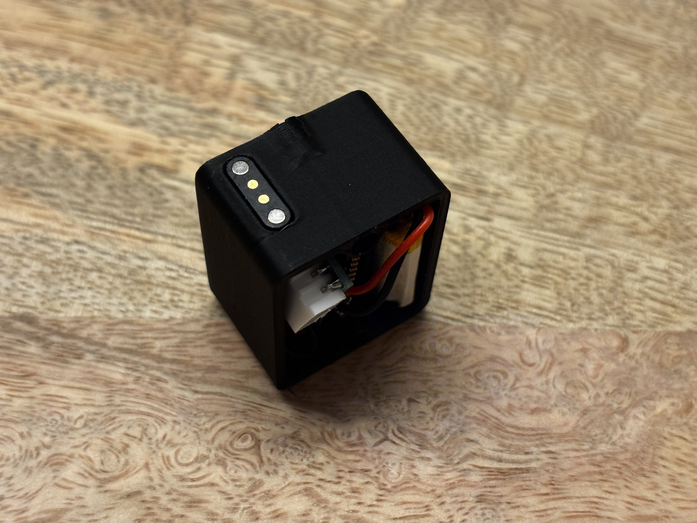 |
| 3D printed enclosure | 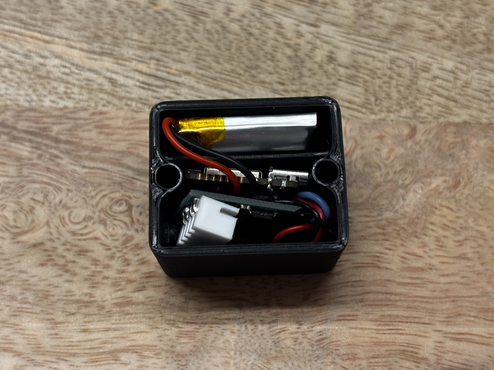 |

Everything — XIAO, HX711, LiPo, and connectors — fits in a small 3D printed box that bolts directly onto the crank arm. I wanted to be able to reach the electronics for testing. But if I were to do it again I would just caulk it on instead of using bolts.

---

## Hardware

| Component | Role | Image |
|---|---|---|
| Seeed XIAO nRF52840 Sense | Microcontroller + BLE + IMU | 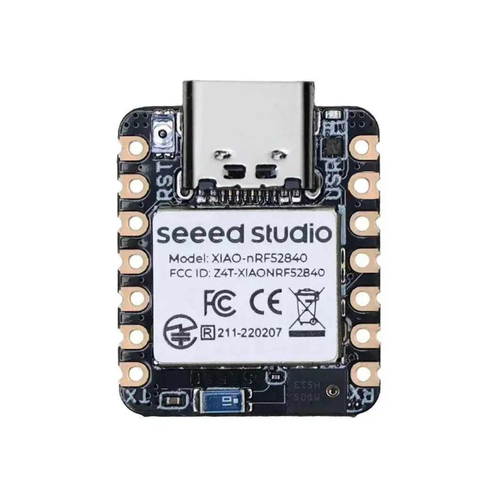 |
| HX711 | 24-bit strain gauge ADC | 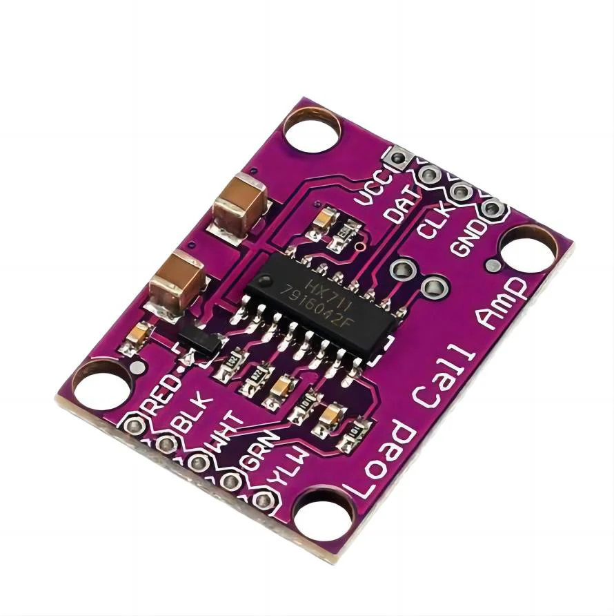 |
| BF1K-3AA strain gauges (×4) | Measure crank deflection | 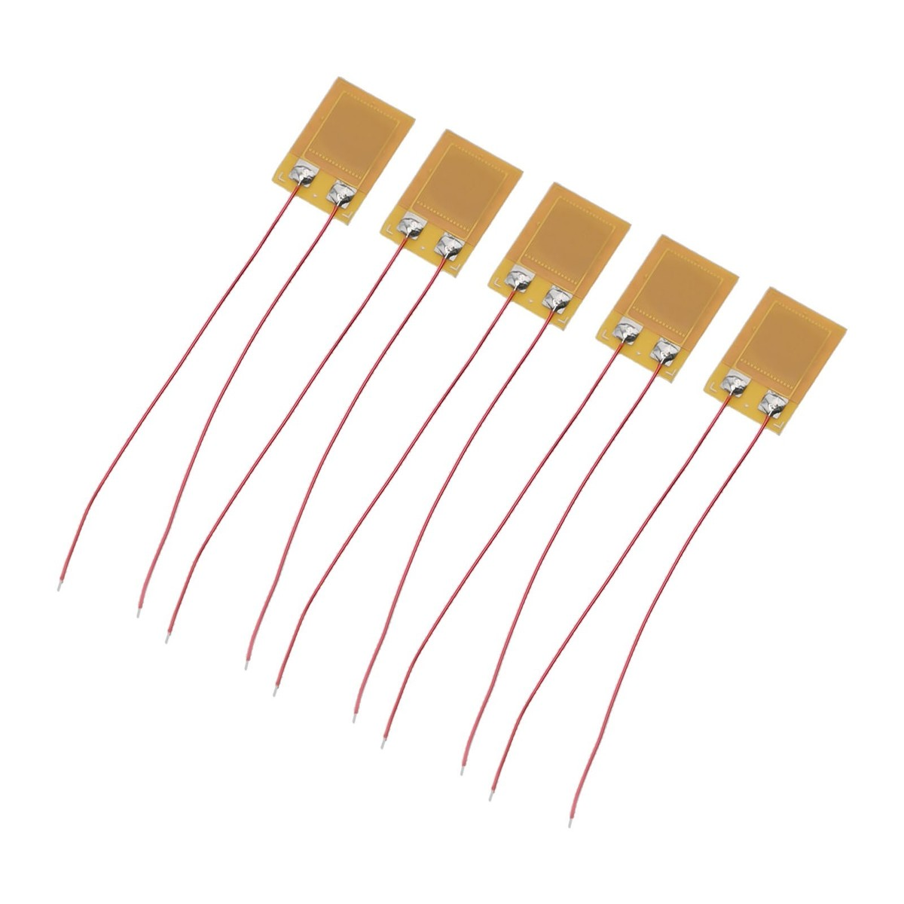 |
| 300mAh LiPo | Power | 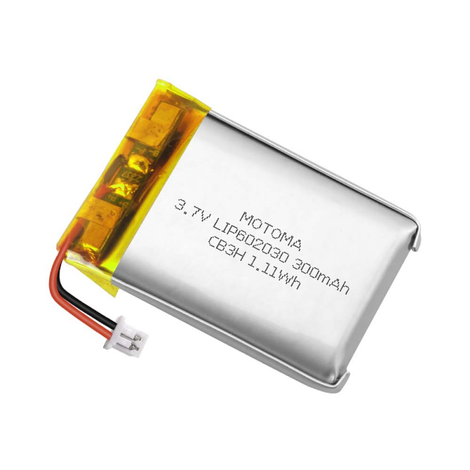 |
| Magnetic charging connector | Weatherproof charging port | 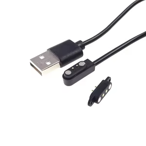 |
| Shimano left crank arm | I hope this is self explanatory | 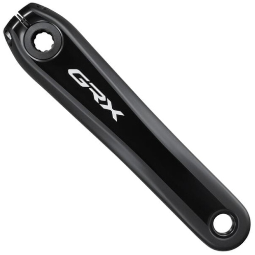 |

### Why 1kΩ gauges?

The BF1K-3AA gauges have 1000Ω resistance each. In a full Wheatstone bridge that draws about **3.3mA** from the 3.3V rail, roughly 3× less than the common 350Ω gauges. Longer battery life, approximately the same measurement accuracy. Easy win.

---

## Wiring

```
HX711 DOUT → XIAO D2
HX711 SCK  → XIAO D3
IMU INT1   → XIAO D7   (wake-on-motion)
```

The LSM6DS3 IMU is built into the XIAO, no extra chips needed for cadence. Everything runs from the XIAO's onboard 3.3V regulator.

---

## Software States

### Active — Riding (~10mA)
The HX711 fires an interrupt at ~80Hz. Each sample reads torque and gyro, accumulates values over one full crank revolution, then broadcasts power + cadence via BLE. Battery level is checked every 12 seconds and sent to the head unit.

If you're coasting or going too slow (under 25 RPM), those samples get ignored.

### Deep Sleep — Idle (~0.07mA)
After **60 seconds** of no pedaling the system shuts down completely:
- HX711 powered off (SCK held high)
- MCU enters **System OFF** (nRF52 lowest power state)
- BLE advertising stopped
- Only the IMU accelerometer stays alive, watching for movement

Any movement wakes it back up. Takes about a second to restart and show up in your head unit again.

---

## First Startup & Calibration

Calibration data is stored in internal flash and survives restarts, so you only do this once, or after remounting the gauges.

Connect using any BLE UART app (I recommend the **Adafruit BluefruitConnect** app). The device advertises as **DIY-Powermeter**.

---

### Step 1 — Tare (zero the sensor)

Remove any load from the pedal and make sure nothing is pushing on the crank. Keep it still.

Send:
```
t
```

The device averages 200 HX711 samples, saves the zero offset, and also calibrates the gyro bias (so cadence is accurate from zero). This takes about 3 seconds.

---

### Step 2 — Scale Factor (hang a known weight)

Attach a known mass to the pedal hole (through the spindle thread or a loop of cord). Then send:

```
c          → calibrate with 10kg
m 7.5      → calibrate with 7.5kg (dumbbell, bucket with water, etc.)
```

The 'm' command lets you input any weight. So just weigh anything (preferably above 5kg) and calibrate with this value

The device records the HX711 count shift under that load and computes the counts-per-Newton scale factor. Both tare and scale factor are saved to flash automatically.

**That's it.** From now on the meter works on every boot without re-calibrating. If you ever remount the gauges or feel like the readings drifted, just repeat steps 1 and 2. But remember that Garmin also prompts you to tare every now and then, this should prevent the values from drifting.

---

## BLE UART Commands

| Command | What it does |
|---|---|
| `i` | Print all available commands |
| `t` | Tare + gyro bias calibration (crank unloaded, still) |
| `c` | Calibrate with 10kg reference weight |
| `m <kg>` | Calibrate with custom mass — e.g. `m 12.5` |
| `l` | Toggle debug logging on/off (persisted to flash) |
| `dfu` | Reboot into DFU bootloader for wireless firmware update |

**Logging** spits out cadence, torque, and power after every revolution over UART. Great for debugging, annoying on actual rides. Turn it off once you're happy with it.

### Garmin Zero Offset

Garmin head units have a built-in "Calibrate Power Meter" option in the sensor menu. This sends a BLE Cycling Power Control Point command that triggers an automatic tare, no phone needed while riding. The displayed offset value shows how much drift has accumulated since the last full calibration.

---

## Power Consumption

| State | Current |
|---|---|
| Riding (BLE active, HX711 sampling) | ~10 mA |
| Deep sleep (System OFF, IMU only) | ~0.07 mA |

At 10mA a 300mAh battery gives ~30 hours of riding. Since sleep kicks in after 60 seconds of stopping, the standby drain between rides is negligible. You'd have to genuinely forget about it for weeks to kill it.

---

## Limitations

- **Single-sided** — only left crank measured; power is doubled to estimate total. Assumes left/right balance, which is fine for training.
- **HX711 ADC** — not the most premium ADC out there, but more than sufficient for DIY. Commercial meters use higher-end 24-bit ADCs with better noise isolation.
- **No temperature compensation** — the full Wheatstone bridge cancels most thermal drift, but a quick `t` after warmup never hurts on cold days.

---

## License

Open hardware / open source. Build your own, improve it, make it weirder. Just have fun with it.